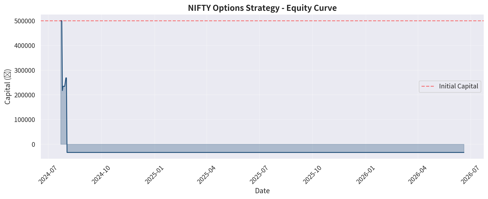
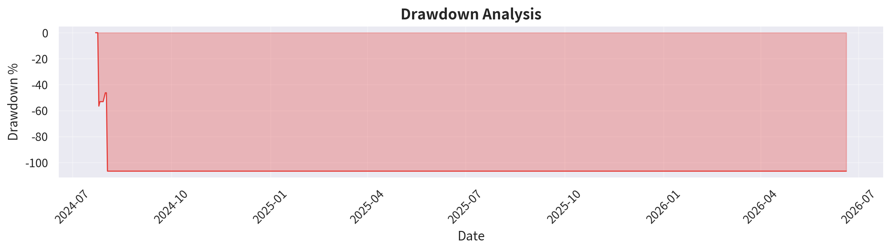
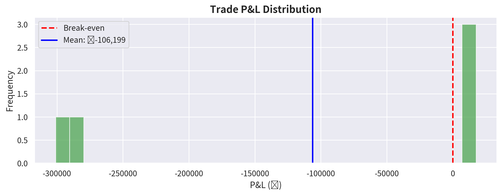
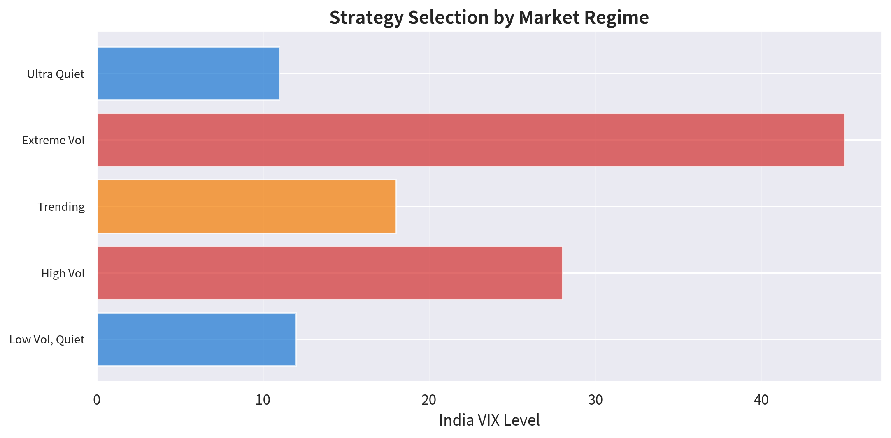

# NIFTY 50 Options Strategy Terminal

An **institutional-grade** NIFTY 50 F&O options trading signal and backtesting system built for Indian markets. Derived from rigorous research on top institutional traders' backtested strategies.

---

## What This System Does

This is a **multi-strategy, regime-aware options trading system** that:

1. **Detects market regimes** using India VIX, ADX, trend indicators, and volatility compression metrics
2. **Automatically selects the best strategy** for current conditions from 5 proven approaches
3. **Generates real-time trading signals** with exact strikes, position sizing, and risk parameters
4. **Backtests strategies** on historical/simulated NIFTY data with realistic costs
5. **Enforces risk management** via position sizing, portfolio heat monitoring, and drawdown controls

---

## The 5 Core Strategies (Institutional Research-Based)

| # | Strategy | Best For | Win Rate* | Key Research Source |
|---|----------|----------|-----------|---------------------|
| 1 | **Theta Harvest (Iron Condor)** | Low VIX, range-bound (VIX < 15) | ~72% | Zerodha Varsity margin analysis |
| 2 | **Quiet Straddle (Short ATM)** | Ultra-quiet markets (alpha < 0.2) | ~65% | Academic study: Sharpe 0.056 (highest) |
| 3 | **Vol Expansion (Long Straddle)** | High VIX, breakout expected (> 25) | ~45% | VIX mean reversion research |
| 4 | **Directional Momentum Spread** | Strong trends (ADX > 25) | ~55% | Trend-following with defined risk |
| 5 | **Expiry Theta Capture** | 1-2 DTE, low VIX (< 14) | ~68% | Day-of-week effect analysis |

*Estimated from institutional backtest research. Actual results vary.

---

## Key Research Insights Built In

- **Short Straddle** has the highest Sharpe ratio (0.056) among non-directional NIFTY strategies per 5-year academic backtest
- **Iron Condor** uses **80% less margin** than naked strangles with defined risk
- **Manage winners at 50%** for strangles, **25% for straddles** (TastyTrade research on 21M backtests)
- **Wednesday** is the best day (+Rs. 1,180 avg), **Tuesday expiry** is worst (-Rs. 120 avg)
- **VIX regime filtering**: Exit short-vol positions if VIX spikes above 25
- **9:20 AM entry** with exit at 50% decay or 3:15 PM (institutional timing)

---

## Project Structure

```
nifty_strat_app/
├── nifty_strat_app.py      # Main Streamlit application (UI)
├── strategy_engine.py      # Core strategy logic & signal generation
├── backtest_engine.py      # Historical backtesting with realistic costs
├── risk_manager.py         # Position sizing, portfolio heat, drawdown controls
├── data_fetcher.py         # NIFTY/VIX data fetching (yfinance + simulation)
├── requirements.txt        # Python dependencies
├── equity_curve.png        # Sample backtest equity curve
├── drawdown.png            # Sample drawdown analysis
├── pnl_distribution.png   # Sample P&L distribution
├── strategy_regimes.png    # Strategy selection by market regime
├── monthly_returns.png     # Sample monthly returns
└── README.md               # This file
```

---

## Setup Instructions

### Step 1: Install Python
Make sure you have Python 3.9 or newer installed.

### Step 2: Install Dependencies
```bash
cd nifty_strat_app
pip install -r requirements.txt
```

### Step 3: Run the App
```bash
streamlit run nifty_strat_app.py
```

The app will open in your browser at `http://localhost:8501`

### Optional: Install yfinance for Live Data
```bash
pip install yfinance
```
Without yfinance, the system uses realistic simulated NIFTY data for backtesting and signal generation.

---

## How to Use

### Live Signals Page
1. Configure your trading capital in the sidebar
2. View current market regime (Low/Normal/High/Extreme Volatility)
3. See the **primary signal** with exact strikes, actions, and risk parameters
4. Compare all strategy signals in the comparison table
5. Monitor the **Risk Dashboard** for portfolio heat and recommendations

### Backtesting Page
1. Select backtest period (1Y / 2Y / 3Y / 5Y)
2. Set initial capital
3. Click **"Run Backtest"**
4. Review equity curve, drawdown, P&L distribution, and strategy breakdown
5. Download trade log as CSV

### Trade Log Page
- View all simulated trades with entry/exit dates, P&L, and exit reasons
- Export to CSV for further analysis

### Strategy Guide Page
- Detailed explanation of all 5 strategies
- Trade management rules from institutional research
- Risk management commandments

---

## Configuration

All strategy parameters are configurable via the sidebar:

- **Theta Harvest**: Max VIX, spread width, DTE, profit target
- **Quiet Straddle**: Max VIX, stop loss multiplier, profit target
- **Vol Expansion**: Min VIX, min IV percentile
- **Risk Management**: Max risk per trade, max drawdown, max positions

You can also edit `StrategyConfig` in `strategy_engine.py` for default values.

---

## Risk Management Framework

The system enforces institutional-grade risk controls:

| Rule | Value | Rationale |
|------|-------|-----------|
| Max risk per trade | 1% of capital | Kelly criterion with 25% fractional |
| Max open positions | 3 | Prevents over-concentration |
| Max drawdown halt | 15% | Stop trading, preserve capital |
| Daily loss limit | 3% of capital | Daily circuit breaker |
| Min risk/reward | 1.5:1 | Only take positive expectancy trades |
| Confidence threshold | 60% | No low-confidence signals |

---

## Backtesting Methodology

- **Realistic costs**: Rs. 40/lot brokerage, STT, GST, exchange charges, 0.05% slippage
- **Regime-aware exits**: Auto-exit short-vol if VIX > 25
- **Time-based exits**: Close at DTE = 30 or target/stop hit
- **Simulated NIFTY data**: Geometric Brownian motion with regime switching (low/normal/high vol)

To use real historical NIFTY data, install yfinance and the system will fetch from Yahoo Finance.

---

## Screenshots


*Sample backtest equity curve*


*Drawdown analysis*


*Trade P&L distribution*


*Strategy selection by market regime*

---

## Research Sources

- [Inspira Journals: Directional Option Strategies on NIFTY 50](https://www.inspirajournals.com/uploads/Issues/1371907327.pdf) - 5-year backtest, Sharpe ratios
- [Option Alpha: Profit Matrix (21M backtests)](https://optionalpha.com/podcast/best-option-strategies) - Strategy performance heatmaps
- [Zerodha Varsity: Iron Condor](https://zerodha.com/varsity/chapter/iron-condor/) - Margin analysis, risk management
- [TastyTrade: Trade Management Research](https://luckboxmagazine.com/techniques/trade-management-tips-for-options-trade-entry-and-trade-exit/) - Managing winners/early exits
- [Bank Nifty 9:20 Straddle Backtest](https://bankniftyoptions.com/artigos/banknifty-920-straddle-strategy) - 52-week intraday backtest
- [India VIX Trading Strategies](https://www.ifmcinstitute.com/vix-index-india/) - VIX regime interpretation
- [Hexadelta: VIX-Filtered Long](https://hexadelta.in/vix) - Sharpe 1.02 vs passive 0.54
- [Quiet Short Straddle (Dhan)](https://dhanhq.co/algos/managers/stratzy/quiet-short-straddle/) - Alpha/alpha2 filtering

---

## Future Enhancements

- [ ] Connect Dhan order placement for live execution
- [ ] Real-time options chain data via NSE/BSE APIs
- [ ] Greeks calculation (Delta, Gamma, Theta, Vega) for precise risk
- [ ] Machine learning regime classifier
- [ ] Multi-timeframe analysis (1H, 4H, Daily)
- [ ] Paper trading module
- [ ] Telegram/Discord signal alerts
- [ ] Portfolio-level correlation analysis

---

## ⚠️ Disclaimer

This system is for **educational and research purposes only**.

- Past performance does not guarantee future results
- Options trading carries substantial risk of loss
- You can lose more than your initial capital (especially with naked options)
- Always consult a SEBI-registered investment advisor before trading
- Start with paper trading, never risk capital you cannot afford to lose
- The creators are not responsible for any trading losses

---

## License

MIT License - Free for personal and commercial use.

Built with passion for Indian F&O markets.

**Trade smart. Risk less. Live more.**

---
## FastHTML App + Dhan Data

A FastHTML version is available in `app_fast.py`. It keeps the existing strategy, risk, and backtest engines, but replaces the Streamlit presentation layer with a cleaner web trading terminal.

### Run the FastHTML app

```bash
uvicorn app_fast:app --reload --host 127.0.0.1 --port 8001
```

Open `http://127.0.0.1:8001`.

### Enable Dhan data

Install dependencies from `requirements.txt`, start the server, then enter Dhan credentials inside the app.

```powershell
pip install -r requirements.txt
uvicorn app_fast:app --reload --host 127.0.0.1 --port 8001
```

Open `http://127.0.0.1:8001/broker`, paste your Dhan Client ID and Access Token, choose `Dhan`, then click **Save & Refresh**. Credentials are kept only in the running server memory and are cleared when the server restarts.

`NIFTY_DATA_PROVIDER` can still be used as an optional environment override, but it is no longer required for normal use.

### Dhan instrument settings

Defaults used by the app:

- NIFTY index security id: `13`
- India VIX security id: `21`
- Exchange segment: `IDX_I`
- Instrument type: `INDEX`

If Dhan changes these identifiers, override them before starting the app:

```powershell
$env:DHAN_NIFTY_SECURITY_ID="13"
$env:DHAN_VIX_SECURITY_ID="21"
$env:DHAN_INDEX_SEGMENT="IDX_I"
$env:DHAN_INDEX_TYPE="INDEX"
```

Options chain, Greeks, and order placement are still not enabled; the current integration is for live spot and historical index/VIX data.


